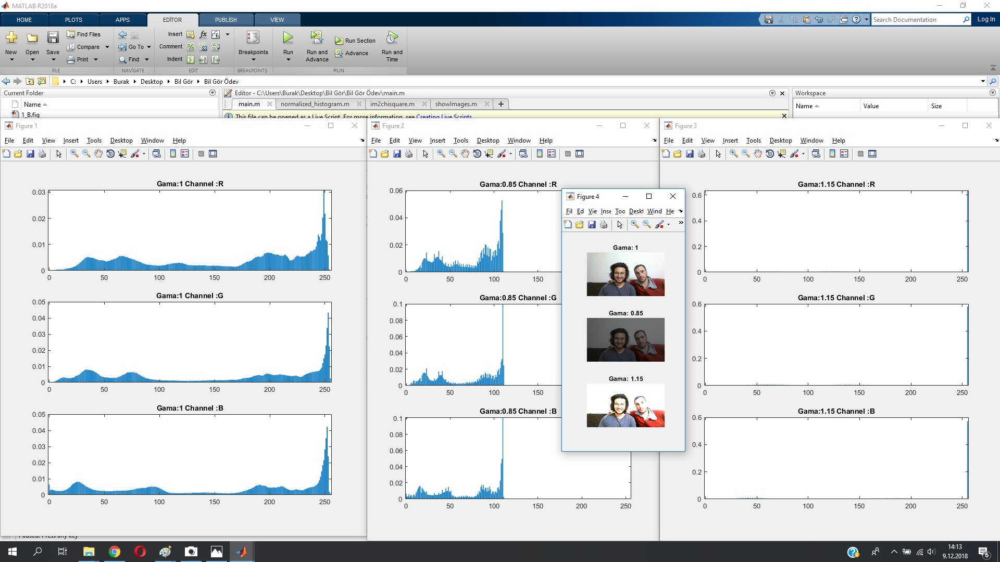

# Content Based Image Retrieval (CBIR) and Chi Square Methods Comparison

It's aimed to observe histogram comparison results when use different methods

## Gama Effect
 s=rγ
 s: output pixel value
 r: input pixel value
 γ: gama value
 
`Gama Effect`

## Gama Effect into [0:255] vector
`Gama Effect into [0:255] vector`

## Normalized Histogram
`Normalized Histogram`

## Histogram Comparison Using 2 Gray Scale Images
`Histogram Comparison Using 2 Gray Scale Images`

## Histogram Comparison Using 2 RGB Images
`Histogram Comparison Using 2 RGB Images`

 

## Results
<table>
  <tr>
    <th>Method</th>
    <th>I1 - I1</th>
    <th>I1 - I2</th>
    <th>I1 - I3</th>
    <th>I1 - I4</th>
  </tr>
  <tr>
    <td>CBIR</td>
    <td>1</td>
    <td>0.85326</td>
    <td style='color:red;'>0.24936</td>
    <td>0.63625</td>
  </tr>
  <tr>
    <td>Chi Square</td>
    <td>0</td>
    <td>0.17551</td>
    <td>5.3196</td>
    <td>0.87289</td>
  </tr>
</table>
